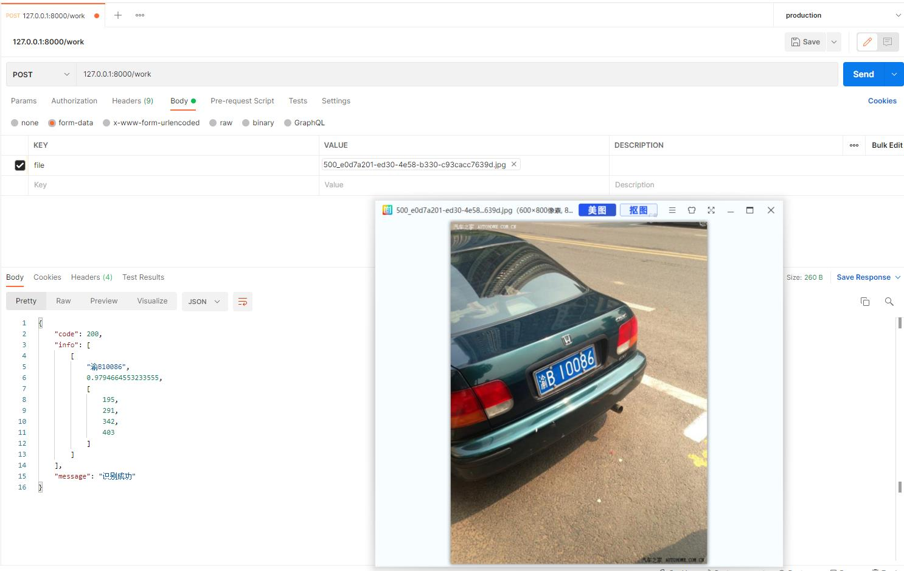

# 车牌识别服务

构建

```
docker build -t car_number:latest .
//或者
docker-compose build
```

安装

```
docker run -d -p 8000:8000 --name car_number car_number:latest
//或者
docker-compose up -d
```

使用



参考

- https://gitee.com/zeusees/HyperLPR